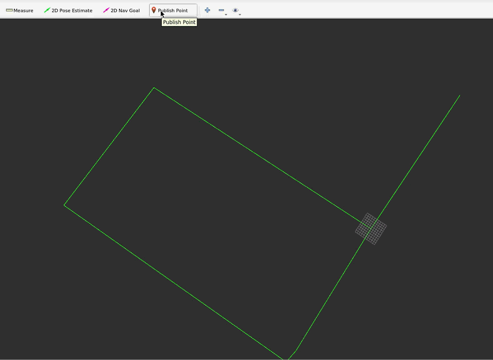

# Overview

osm_planner implements global path planning based on geographic vectors. Given a start and end point, it can automatically plan a path.

# What is OSM?

OpenStreetMap (OSM) is a free, open online map project aiming to create a freely editable world map. This project is driven by a volunteer community, and anyone can participate and contribute data. Here's a detailed introduction to OpenStreetMap:

### Key Features

1. Open Data： OSM data is free to use for any purpose, including commercial use. It is licensed under the open-source Open Database License (ODbL).
2. Global Coverage：OSM covers map data globally, including roads, buildings, natural landscapes, etc.
3. Community-Driven： Maintained and edited by volunteers worldwide. Anyone can register an account and start contributing data.
4. Diverse Data Layers： OSM includes not only roads and buildings but also trails, rivers, parks, railways, public transport routes, and more.
5. Flexible Usage
   - Data can be downloaded in various formats, including XML, PBF, Shapefiles, etc.
   - Provides multiple API interfaces to facilitate application development.

### Main Components

1. Nodes
   - Basic geographic data units representing a specific point on the map, usually using latitude and longitude coordinates.
2. Ways
   - Composed of multiple nodes forming a line segment, which can represent roads, rivers, boundaries, etc.
3. Relations
   - Complex structures composed of multiple nodes and ways, representing bus routes, boundaries, and more complex relationships.
4. Tags
   - Add information to nodes, ways, and relations. Tags are key-value pairs; for example, a road tag might be `highway=residential`.

### Use Cases

1. Navigation and Positioning
   - Used in GPS devices, navigation systems, and map applications like OsmAnd, Maps.me, etc.
2. Geographic Information Systems (GIS)
   - OSM data can be integrated into various GIS platforms for analysis and visualization.
3. Urban Planning and Research
   - Urban planners and researchers can use OSM data for urban development, traffic flow analysis, and more.
4. Game Development
   - Used to create game environments with real-world geographic information.
5. Disaster Response
   - Volunteers can quickly update OSM data after natural disasters like earthquakes or floods, providing up-to-date map information to aid rescue efforts.

# How to Obtain OSM Data

Use JOSM (Java OpenStreetMap Editor), a powerful desktop editor.

Refer to the specific process at https://py1995.blog.csdn.net/article/details/138162392.

# Common Parameter Configuration

Configure parameters in `./config/ros_param.yaml`.

```yaml
yaml复制interpolation_max_distance: 1.5 # Maximum interpolation distance between two points

filter_of_ways: ["footway"]     # Filter for parser. Parse only routes that have values on the list; if the value is "all", then parse all routes

footway_width: 3  # Width of the road
```

# Setting the Origin Latitude and Longitude in the Cartesian Coordinate System

In a multi-sensor fusion SLAM program with a GPS sensor, add the following code:

```
ros::param::set("origin_latitude", gpsMsg->latitude);
ros::param::set("origin_longitude", gpsMsg->longitude);
```

This coordinate is used to convert latitude and longitude to a local Cartesian coordinate system.

# Compile and Run

```bash
bash复制mkdir -p ~/catkin_ws/src
cd ~/catkin_ws/src
git clone https://yunshitu.coding.net/p/navigation_and_planning/d/osm_planner/git
cd ..
catkin_make -DCATKIN_WHITELIST_PACKAGES="osm_planner"
source ./devel/setup.bash
roslaunch osm_planner parser_node.launch
```

# How to Plan a Path

Set the starting point: Click the "Publish Point" button in RViz.

Set the endpoint: Click the "2D Nav Goal" button in RViz.

# Demonstration


